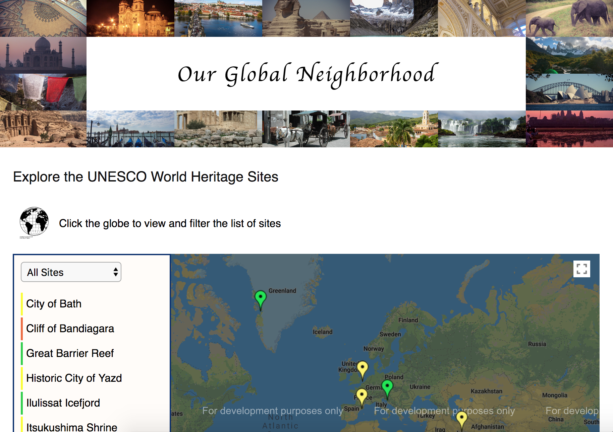

# Udacity Front End Nanodegree Project 7- Neighborhood Map

## Project Description
This project was built as part of the Udacity FrontEnd Nanodegree curriculum. I built this single page application from scratch using Create React App. I used the Google Maps JavaScript API to load a map to the page, with markers identifying select UNESCO World Heritage Sites.  When a map marker is clicked, an info window pops up displaying a photo of the site, along with some additional site related information. The info window photos were obtained using the Flickr API. 

The user can filter the list of sites by type (natural, cultural, mixed) by using the select dropdown menu. Clicking or tabbing onto any site in this list view of sites will open the corresponding info window. 

This project was very challenging, but along the way I really solidified my understanding of the fetch API, Promises and other es6 features and syntax. I developed a deeper understanding of and appreciation for accessibility. I especially enjoyed delving deeper into React. I still have a lot to learn, but I feel like studying React has made me a better javascript developer in general. 

You can see the live site here https://msksfo.github.io/udacityFEND-neighborhoodMap/

## Project Dependencies 
* react
* react-dom
* prop-types

## Launch the app in your browser:
* clone or download this repo
* install all project dependencies with `npm install`
* run `npm start` in the project root directory to start the development server and launch the   app in the browser window

## Offline First
By using Create React App, the production build is a fully functional, offline-first Progressive Web App. `npm run build` will create a build directory with the production build of the app. 

The service worker is functional on the production build only. If you need to test the service worker during development, you can refer to the [Create React App](https://github.com/facebookincubator/create-react-app) documentaion here.

## Use the app
* Click a map marker to see a photo of the site
* Toggle the list view of sites by clicking or tabbing onto the globe icon
* Filter the sites according to type, if you wish, by using the select dropdown menu
* Click or tab onto a site in the list view to open the associated info window

## Credits
 * Map by [Google Maps JavaScript API](https://developers.google.com/maps/documentation/javascript/tutorial)
 * Info window images obtained from the [Flickr API](https://www.flickr.com/services/api/)
 * Globe icon by Nick Novell from the [Noun Project](https://thenounproject.com/)
 * Many thanks to Yahya Elharony for his [YouTube series](https://www.youtube.com/watch?v=ywdxLNjhBYw&t=134s) on using the Google Maps JavaScript API in a React application without any third party libraries.
 * Header font by Google Fonts 

## Create React App

This project was bootstrapped with [Create React App](https://github.com/facebookincubator/create-react-app). You can find more information on how to perform common tasks [here](https://github.com/facebookincubator/create-react-app/blob/master/packages/react-scripts/template/README.md).

